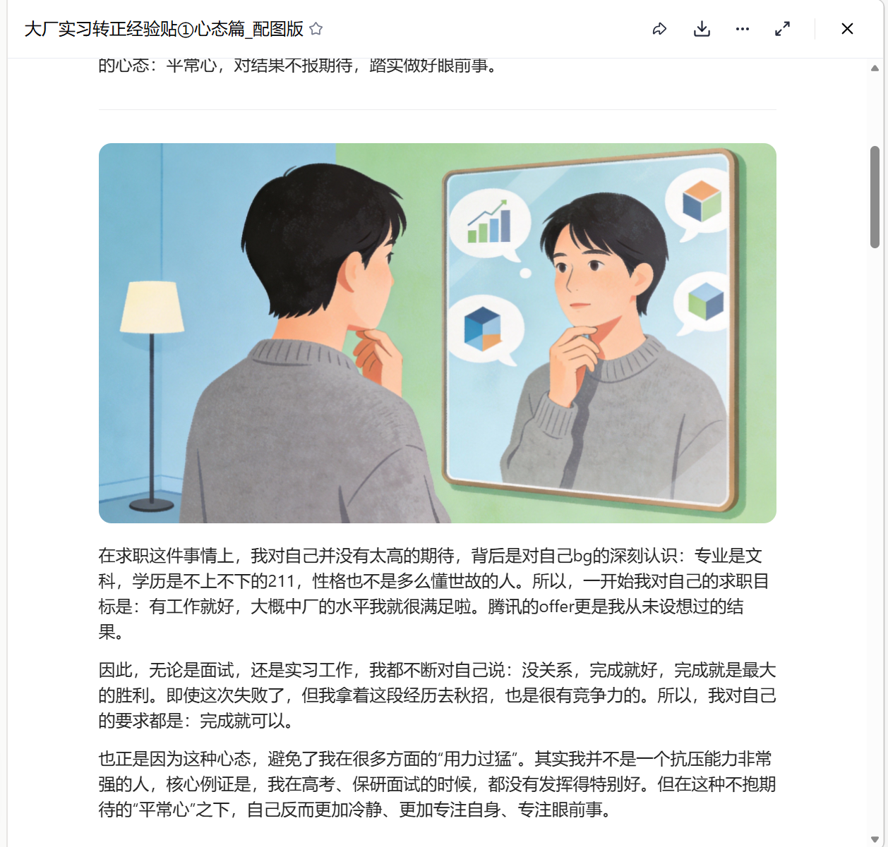

# Long Article Illustration Assistant

An AI Skill configuration for automatically generating illustrations for long-form articles.

## ✨ Features

- **Smart Paragraph Segmentation**: Automatically identifies article structure and divides content by semantic boundaries
- **Prompt Generation**: Creates high-quality image generation prompts for each paragraph
- **Multiple Styles**: Flat illustration, watercolor, cartoon, Chinese ink, tech, minimalist
- **Character Consistency**: Maintains consistent character appearance through anchor descriptions
- **Text-Free Images**: Automatically adds parameters to prevent garbled text in generated images

## 📁 File Structure

```
├── SKILL.md                    # Main config file defining the complete workflow
├── references/
│   ├── style-presets.md        # 6 style presets and prompt templates
│   ├── paragraph-rules.md      # Detailed paragraph segmentation rules
│   └── troubleshooting.md      # Common issue solutions
└── preview/                    # Preview examples
    ├── 校园主题文章_配图效果.pdf   # Campus theme article demo
    ├── 职场主题文章_配图效果.pdf   # Workplace theme article demo
    └── 案例*.png                 # Sample images
```

## 🚀 Usage

1. Import `SKILL.md` and the `references/` folder into an AI assistant that supports Skills
2. Provide the AI with your long-form article
3. Optional parameters:
   - **Image Style**: Default is flat illustration
   - **Aspect Ratio**: Default is 16:9
   - **Illustration Density**: Default is one image per 2-3 paragraphs

## 🎨 Supported Styles

| Style | Best For |
|-------|----------|
| Flat Illustration | Tech, business, tutorials |
| Watercolor | Emotional, literary, lifestyle |
| Cartoon | Casual, humor, children's content |
| Chinese Ink | Traditional culture, classical |
| Tech/Futuristic | AI, data, future topics |
| Minimalist | Premium, simple, business |

## 📐 Supported Aspect Ratios

| Usage | Ratio |
|-------|-------|
| WeChat Article Cover | 2.35:1 |
| WeChat Article Content | 16:9 |
| Xiaohongshu (RED) | 3:4 |
| Square | 1:1 |

## 📸 Preview



## 📄 License

This project is open source under the [MIT License](LICENSE).
